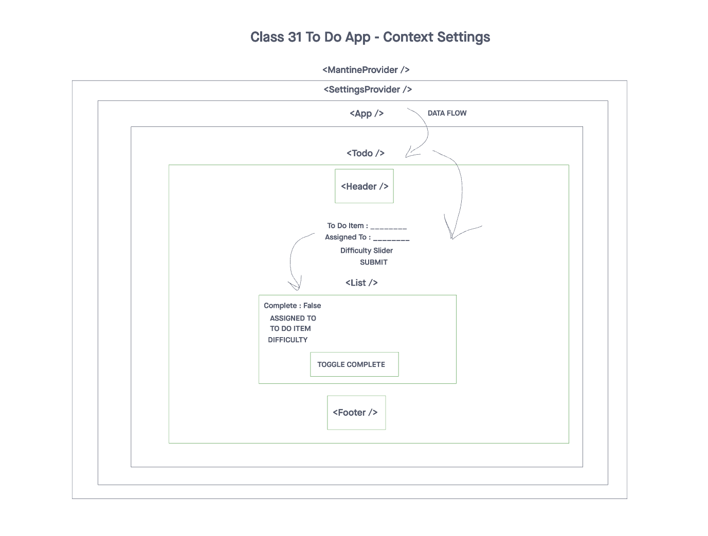

# To Do Application

## Description

Stay organized and boost productivity with our intuitive to-do application. Effortlessly manage tasks, set priorities, and track your progress. Never miss an important deadline again – get things done efficiently and make the most of your day.

## Features

- To Do List Manager Phase 1: Incorporate configuration settings to the application.


## Table of Contents

1. [Installation](#installation)
2. [Usage](#usage)
3. [UML Diagram](#uml-diagram)
4. [PR Link](#pr-link)
5. [Contributors](#contributors)

## Installation

To get started with the application, follow these steps:

1. Clone the repository to your local machine using this link: [Repository Link](https://github.com/cleecoloma/todo-app)
2. Install the required dependencies using the following command:

   ```bash
   npm install
   ```

## Usage

> Test: `npm test`

## UML Diagram


## PR link
[PR Link Class 31](https://github.com/cleecoloma/todo-app/pull/1)

## Contributors
* Chester Lee Coloma
* ChatGPT (used for most tests)
