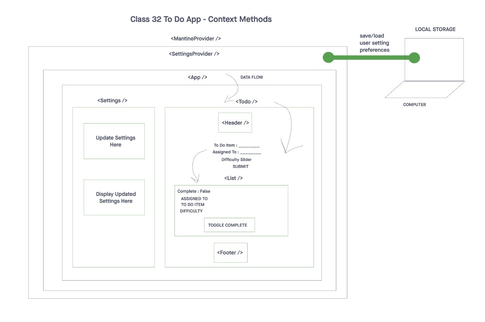

# To Do Application

## Description

Stay organized and boost productivity with our intuitive to-do application. Effortlessly manage tasks, set priorities, and track your progress. Never miss an important deadline again – get things done efficiently and make the most of your day.

## Features

- To Do List Manager Phase 1: Incorporate configuration settings to the application.
- To Do List Manager Phase 2: Incorporate configuration settings to the application - Settings Page and Local Storage Functionality.
- To Do List Manager Phase 3: Adding security and access controls to the application.
- To Do List Manager Phase 4: Integrating with a live API.


## Table of Contents

1. [Installation](#installation)
2. [Usage](#usage)
3. [UML Diagram](#uml-diagram)
4. [PR Link](#pr-link)
5. [Contributors](#contributors)

## Installation

To get started with the application, follow these steps:

1. Clone the repository to your local machine using this link: [Repository Link](https://github.com/cleecoloma/todo-app)
2. Install the required dependencies using the following command:

   ```bash
   npm install
   ```

## Usage

> Test: `npm test`

Signup:
```text
  username: {ENTER_NAME}
  password: {ENTER_PASSWORD}
  role: {PICK_ROLE}
```
Signin
```text
  username: {ENTER_NAME}
  password: {ENTER_PASSWORD}
```

> Install Auth Server: [To Do API - Auth Server](https://github.com/cleecoloma/todo-api)

## UML Diagram





## PR link
[PR Link Class 34](https://github.com/cleecoloma/todo-app/pull/4)
[PR Link Class 33](https://github.com/cleecoloma/todo-app/pull/3)
[PR Link Class 32](https://github.com/cleecoloma/todo-app/pull/2)
[PR Link Class 31](https://github.com/cleecoloma/todo-app/pull/1)

## Questions
1. Describe how global state is consumed by the components.
> Components consume global state using the useContext hook by specifying the context they want to access, and then they can access and modify the global state values stored in that context.
2. Describe the operation of the hook: `useForm()`.
> The `useForm` hook is designed to handle form-related logic. It maintains a state object called `values` to store form input values and provides functions like `handleChange` to update these values in response to user input and `handleSubmit` to submit the form data by invoking a callback function passed as an argument. It also allows setting default form values when the component is mounted or when `defaultValues` change, ensuring the form remains synchronized with the provided default values.

## Contributors
* Chester Lee Coloma
* ChatGPT (used for most tests)
